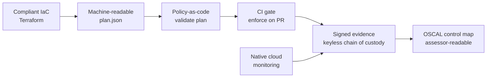

## GRC Engineering Pipeline

A single, connected compliance pipeline that takes a piece of cloud infrastructure from
"it works" to "it is audit-defensible" — and proves every step along the way as
machine-readable evidence. Compliant infrastructure-as-code feeds policy-as-code, which
runs as a CI gate on every change, which produces signed evidence with a verifiable chain
of custody, which a native monitoring layer corroborates, all mapped to OSCAL so an
assessor can follow the controls without scheduling a single meeting.

It is built one layer a week as part of the [GRC Engineering Club](https://www.patreon.com/GRCEngineeringClub)
6-Week Pipeline Challenge (`#GRCEngClubChallenge`). Each week adds a layer to the *same*
system rather than a disconnected exercise — the integration is the point.

> **Status:** Phase 1 in development. Week 1 (compliant IaC + machine-readable evidence)
> is the active build; weeks 2–6 are planned and fill in layer by layer.

## Why This Exists

Most compliance "evidence" is a screenshot pasted into a control narrative — a point-in-time
artifact a human had to capture and a human has to trust. This repo treats evidence as a
data product instead: every control is enforced in code, and every run emits structured,
machine-readable proof that the control is in place. The differentiator is the full chain —
not just "the bucket is encrypted," but a signed, timestamped artifact that anyone can
verify was produced by the pipeline and has not been altered since, mapped to the exact
NIST 800-53 control it satisfies. That is what a continuous-authorization (FedRAMP 20x)
posture actually requires, and what most teams do not have.

## Architecture Overview



Each box is one week of the build. Infrastructure is defined with the controls baked in
(week 1) and emits its own evidence; policy-as-code reads that evidence and proves the
controls hold (week 2); a CI gate makes the policies block non-compliant changes before
merge (week 3); every run's evidence is cryptographically signed for non-repudiation
(week 4); a native monitoring layer captures runtime findings as evidence (week 5); and
everything is mapped to OSCAL so the whole bundle is consumable by an assessment tool
without manual transcription (week 6).

## Compliance Controls Addressed

Controls accrue across the pipeline. The table lists the headline control per layer; the
[pipeline roadmap](#pipeline-roadmap) breaks down each week in full.

| NIST 800-53 Rev 5 | FedRAMP High | CJIS v6.0 | How This Repo Validates |
|---|:---:|:---:|---|
| SC-28 (Protection at Rest) | Yes | FIPS-validated crypto + agency-managed keys | Encryption enforced in IaC; algorithm surfaced in plan evidence |
| AC-3 (Access Enforcement) | Yes | — | Public-access block on all four flags, proven in the plan |
| CM-6 (Configuration Settings) | Yes | — | Versioning + mandatory tagging enforced at the provider level |
| AU-2 / AU-3 (Audit Events / Content) | Yes | 1-yr retention + weekly review | Access logging wired bucket-to-bucket, captured as evidence |
| CM-3 (Configuration Change Control) | Yes | — | Policy-as-code gate blocks non-compliant changes on every PR |
| AU-10 / SI-7 (Non-repudiation / Integrity) | Yes | — | Keyless-signed evidence with a verifiable chain of custody |
| CA-7 / SI-4 (Continuous Monitoring) | Yes | — | Native cloud monitoring snapshots findings as evidence |
| CA-2 (Control Assessments) | Yes | — | OSCAL control map points an assessor at the signed bundles |

## How an Auditor Uses This Output

Each layer emits an artifact that maps directly to a NIST 800-53A assessment objective
without a human transcribing anything. For SC-28, an assessor does not take the engineer's
word that data is encrypted — they read the `apply_server_side_encryption_by_default` block
in the captured `terraform show -json` output and see `AES256` enforced before the resource
was ever created. The policy-as-code layer turns that read into an automated test, and the
CI gate turns the test into a preventive control with a pass/fail record on every pull
request. By week 4 the evidence is signed, so the assessor can verify the artifact was
produced by this pipeline and has not been altered since capture — the chain-of-custody
property that distinguishes defensible evidence from a screenshot. Week 6 closes the loop
by expressing the control-to-evidence mapping in OSCAL, the format assessment tooling
ingests directly, collapsing the detect → transform → retain → review evidence loop into
something an assessor consumes in minutes rather than a review meeting.

## FedRAMP 20x Alignment

This repo is a working model of the FedRAMP 20x compliance-as-code posture:

- **Compliance-as-code:** every control is encoded as Terraform and policy-as-code, not prose.
- **Machine-readable evidence:** the pipeline emits `terraform show -json`, policy result
  JSON, and OSCAL — no screenshots anywhere in the evidence path.
- **Automated scanning:** the policy gate validates the plan against the controls on every change.
- **Continuous monitoring:** the CI gate runs per-PR and the week-5 layer stands up native
  cloud monitoring, corroborating the IaC posture at runtime.
- **Signed, verifiable evidence:** keyless signing gives each artifact non-repudiation and a
  chain of custody — the integrity property a Key Security Indicator (KSI) program depends on.
- **30-day vs 90-day review window:** because every artifact is machine-readable and signed,
  it is consumable on the continuous (30-day) cadence rather than a manual 90-day review.

## CJIS v6.0 Relevance

CJIS v6.0 (audit standard since April 1, 2026; aligned to NIST 800-53 Rev 5 as of Dec 2024)
adds deltas on top of the FedRAMP High baseline this pipeline targets. The two that bind on
an evidence pipeline like this:

- **SC-28 / SC-13 — encryption:** CJIS requires FIPS 140-2/3 validated cryptographic modules
  and agency-managed keys (CMK) for Criminal Justice Information, beyond the AES-256 the base
  build enforces. A CJI deployment would swap the SSE configuration to a customer-managed KMS key.
- **AU-6 — audit review:** CJIS mandates a minimum 1-year retention and weekly review of audit
  records, tighter than the base baseline. The access-logging layer satisfies the capture
  requirement; retention and review cadence are policy choices layered on top.

## Sample Evidence Output

Week 1 produces its evidence from the Terraform plan — no apply required, zero cost. The
artifact is an excerpt of `terraform show -json`, showing the SC-28 control enforced before
any resource exists:

```json
{
  "address": "aws_s3_bucket_server_side_encryption_configuration.primary",
  "type": "aws_s3_bucket_server_side_encryption_configuration",
  "values": {
    "rule": [
      {
        "apply_server_side_encryption_by_default": [
          { "sse_algorithm": "AES256" }
        ],
        "bucket_key_enabled": true
      }
    ]
  }
}
```

Each week's real artifacts land in `week-N/evidence/`. Generated with:

```bash
terraform plan -out=tfplan
terraform show -json tfplan > evidence/plan.json
```

## Pipeline Roadmap

| Week | Layer | Status | Controls |
|---|---|:---:|---|
| 1 | Compliant resource (Terraform S3 + JSON evidence) | In progress | SC-28, AC-3, CM-6, AU-2/AU-3 |
| 2 | Policy-as-code (validate the plan, pass + fail tests) | Planned | CM-3, SA-11, CM-6 |
| 3 | CI gate (enforce policies on every PR) | Planned | CM-3, SA-15, CM-4 |
| 4 | Signed evidence (keyless chain of custody) | Planned | AU-10, AU-9, SI-7 |
| 5 | Native monitoring (snapshot findings, then tear down) | Planned | CA-7, SI-4, RA-5, AU-6 |
| 6 | OSCAL control map + portfolio case study | Planned | CA-2, PM-31 |

## Repository Structure

```
grc-engineering-pipeline/
├── week-1/                      # Compliant resource — Terraform + evidence
│   ├── main.tf                  # Bucket + controls (SC-28, AC-3, CM-6, AU-3)
│   ├── variables.tf
│   ├── outputs.tf
│   ├── verify.sh                # Post-apply control checks (optional path)
│   └── evidence/                # Machine-readable proof (plan.json)
├── week-2/ … week-6/            # Added layer by layer
├── LICENSE
└── README.md
```

## What This Project Demonstrates

Framework-to-infrastructure fluency: reading a NIST 800-53 control statement and expressing
it as enforced, testable code rather than a narrative. Policy-as-code and CI-gate discipline:
making compliance a preventive control that blocks non-compliant changes before merge.
Evidence-integrity engineering: keyless signing and chain of custody, the property that turns
output into defensible evidence. And OSCAL fluency: speaking the machine-readable language
assessors consume. Together these are the core of GRC engineering — treating audit evidence
as a data product, built in public, one verifiable layer at a time.

## References

- [GRC Engineering Club](https://www.patreon.com/GRCEngineeringClub) — 6-Week Pipeline Challenge
- [NIST 800-53 Rev 5](https://csrc.nist.gov/pubs/sp/800/53/r5/upd1/final)
- [Terraform AWS Provider](https://registry.terraform.io/providers/hashicorp/aws/latest/docs)
- [OSCAL](https://pages.nist.gov/OSCAL/)

## License

MIT
